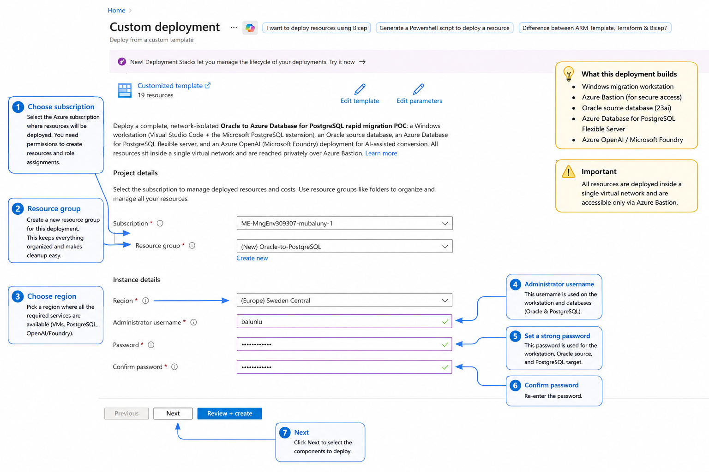
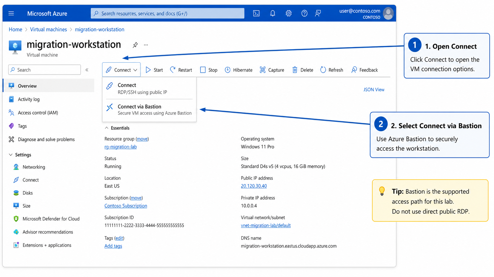
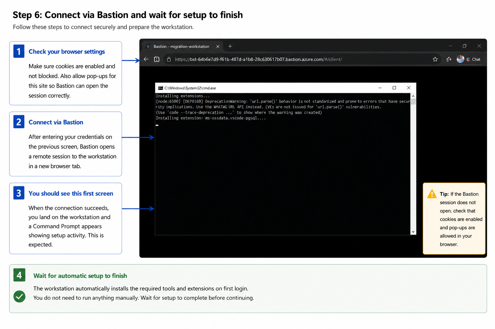
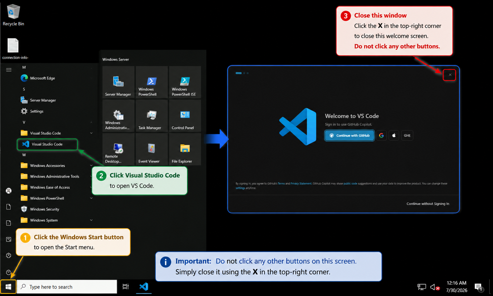

# Azure deployment — Oracle to PostgreSQL rapid migration POC

This package can provision a **complete, self-contained rapid migration POC** or only the
components you select:

- a **Windows Server 2022** workstation running desktop **Visual Studio Code + the Microsoft
  PostgreSQL extension**,
- an **Oracle source database** (Oracle Database Free 23ai in a container) pre-seeded with a
  sample **HR** schema,
- an **Azure Database for PostgreSQL flexible server** (private access) as the target, and
- an **Azure OpenAI (Microsoft Foundry)** model deployment that powers the AI conversion.

The workstation performs the conversion through Azure OpenAI and validates it against the
PostgreSQL server — exactly the local workflow, but entirely inside the virtual network so
it can reach the privately networked Oracle source.

No custom conversion logic runs on the workstation. The PostgreSQL extension's Migration
Wizard does the work; the POC only stands up an environment that has line of sight to
Oracle, PostgreSQL, and Azure OpenAI.

## What gets deployed

The portal defaults to **Deploy all components**. Clear that option to choose any combination
of the workstation, Oracle source, PostgreSQL target, and AI conversion components. Shared
networking is created automatically when a selected component needs it; Azure Bastion is
created only with the workstation.

| Component | Resource | Notes |
|---|---|---|
| Workstation | Windows Server 2022 VM (`migration-workstation`) | VS Code + PostgreSQL extension + Oracle Instant Client + Azure CLI; system-assigned identity |
| Oracle source | Ubuntu VM (`oracle-source-vm`) | Runs Oracle Database Free 23ai in a container, seeded with the HR schema; service `FREEPDB1`, port 1521 |
| PostgreSQL target | Azure Database for PostgreSQL flexible server | Private access into a delegated subnet + private DNS zone; no public endpoint |
| AI conversion | Azure OpenAI account + model deployment | Default model `gpt-5-mini`; workstation identity granted **Cognitive Services OpenAI User** |
| Network | VNet `10.42.0.0/16`, NSG, Azure Bastion (Standard) | Bastion tunneling for private RDP; subnets for default, Bastion, Oracle, and PostgreSQL |

## What gets installed on the VM

| Layer | Tool | Purpose |
|---|---|---|
| Editor | Visual Studio Code (desktop) | Hosts the official conversion experience |
| Conversion | PostgreSQL extension (`ms-ossdata.vscode-pgsql`) | Migration Wizard + Microsoft Foundry conversion |
| Assist | GitHub Copilot + Copilot Chat | In-editor guidance during review |
| Oracle | Oracle Instant Client 21 (thick client mode) | Native Oracle Net encryption to the source |
| Cloud | Azure CLI | `az login` for Microsoft Entra ID / Foundry / target DB |
| OS | Windows Server 2022 (Desktop Experience) | Built-in RDP, reached privately over Bastion |

The VM is provisioned by an Azure **Run Command** that executes `setup.ps1`. Progress is
logged to `C:\oracle-workstation-setup.log` on the VM (ends with `PROVISION_COMPLETE`).
The PostgreSQL extension and Copilot finish installing at your first interactive logon.

## Prerequisites

- Azure subscription + `az` CLI logged in
- Permission to **create role assignments** in the target resource group (**Owner** or **User Access Administrator**). The template grants the workstation identity the Cognitive Services OpenAI User role; without this permission the deployment fails at the role assignment.
- The `Microsoft.CognitiveServices` and `Microsoft.DBforPostgreSQL` resource providers registered in the subscription (`az provider register --namespace Microsoft.CognitiveServices` / `Microsoft.DBforPostgreSQL`)
- The Azure CLI **`bastion`** extension for the connection step (`az extension add -n bastion`, or allow dynamic install)
- A strong password for the admin account — reused for the workstation RDP login and the Oracle and PostgreSQL admin accounts; must meet Windows complexity rules
- Enough vCPU quota for the chosen VM sizes in your region. The defaults are `Standard_D4s_v3` (workstation, 4 vCPU) and `Standard_D2s_v3` (Oracle source, 2 vCPU) — 6 vCPU of the **Dsv3** family. If you have no quota, check `az vm list-usage -l <region>` and pass sizes from a family you do have (for example `-p vmSize=Standard_D4s_v5 oracleVmSize=Standard_D2s_v5`)
- A currently deployable Azure OpenAI model in your region. The default is `gpt-5-mini` (`2025-08-07`, `GlobalStandard`). If preflight reports the model is deprecating, list available models with `az cognitiveservices account list-models` and pass `-p openAiModelName=<name> openAiModelVersion=<version>`.

## Access model

The VM is **RDP only, via an Azure Bastion tunnel** — no SSH, no public RDP port, and no
public web ports. RDP (3389) is allowed solely from within the virtual network, so the
only way in is the Bastion tunnel. The login password is set at deploy time
(`adminPassword`); reset it later without a console using `az vm run-command`.

## Deploy

The simplest path is the one-click **Deploy to Azure** button, which opens the Azure
portal with a component selector followed by configuration for only the selected components.
No local tooling is required.

[](https://portal.azure.com/#blade/Microsoft_Azure_CreateUIDef/CustomDeploymentBlade/uri/https%3A%2F%2Fraw.githubusercontent.com%2FBalunywa%2Foracle-to-postgres-poc%2Fmain%2Fdeploy%2Fazure%2Fazuredeploy.json/createUIDefinitionUri/https%3A%2F%2Fraw.githubusercontent.com%2FBalunywa%2Foracle-to-postgres-poc%2Fmain%2Fdeploy%2Fazure%2FcreateUiDefinition.json)

### Configure project details

1. Select the Azure subscription where you want to deploy the resources. Your account needs
  permission to create resources and role assignments.
1. Create a resource group, or select an existing resource group for the deployment.
1. Select a region that supports the VM sizes, Azure Database for PostgreSQL, and Azure OpenAI
  model used by the components you plan to deploy.
1. Enter the administrator username used by the selected workstation, Oracle source, and
  PostgreSQL target components.
1. Enter a password that meets the displayed complexity requirements.
1. Confirm the password.
1. Select **Next** to choose the components to deploy.

[](media/deployment-guide/01-configure-project-details.png)

### Select components

1. On the **Components** tab, open **Components to deploy**.
1. Keep **Select all** selected for the complete end-to-end POC. This option deploys the
  workstation and Azure Bastion, Oracle source, PostgreSQL target, and AI conversion resources.
1. For a partial environment, clear **Select all**, and then select one or more individual
  components. At least one component is required.
1. Select **Next** to configure the selected components.

[](media/deployment-guide/02-select-components.png)

### Configure components

1. On **Configuration**, review the sections for the components you selected. Unselected
  component settings aren't shown.
1. Choose the workstation and Oracle VM sizes. The defaults are suitable for a rapid POC;
  change them when your region or subscription has different quota or availability.
1. Choose the PostgreSQL compute tier. **Burstable** is the economical default for this lab.
1. Confirm the Azure OpenAI model deployment name. Keep `gpt-5-mini` unless you changed the
  model parameters for your deployment.
1. Select **Review + create**.

[](media/deployment-guide/03-configure-components.png)

### Review and create

1. On **Configuration**, review the settings shown for the components you selected, and then
  select **Review + create**.
1. Confirm the subscription, resource group, region, and administrator details under **Basics**.
1. Confirm that **Components** lists only the services you intend to deploy.
1. Review the VM sizes, PostgreSQL tier, and model deployment name under **Configuration**.
1. After validation succeeds, select **Create**. Select **Previous** first if you need to change
  any setting.

[](media/deployment-guide/04-review-and-create.png)

To deploy from the command line instead:

```bash
az group create -n oracle-bridge-rg -l westeurope

az deployment group create -g oracle-bridge-rg -f deploy/azure/main.bicep \
  -p adminUsername=azureuser \
     adminPassword='<strong-password>'
```

All four components are enabled by default for CLI deployments. To deploy a subset, set the
unwanted component parameters to `false`. For example, this deploys only PostgreSQL and
Azure OpenAI:

```bash
az deployment group create -g oracle-bridge-rg -f deploy/azure/main.bicep \
  -p adminUsername=azureuser \
     adminPassword='<strong-password>' \
     deployWorkstation=false \
     deployOracle=false
```

The component parameters are `deployWorkstation`, `deployOracle`, `deployPostgres`, and
`deployOpenAi`.

Outputs include `publicFqdn`, `vmResourceId`, `bastionRdpTunnelCommand`, `oraclePrivateIp`,
`oracleServiceName`, `postgresFqdn`, `postgresAdmin`, `foundryEndpoint`, and
`foundryDeployment`. Outputs for components that were not selected are empty strings.

### Validate deployed resources

1. After the deployment succeeds, open its resource group in the Azure portal.
1. On **Overview**, review **Resources** and confirm that the resources for each selected
  component were created successfully. A partial deployment contains fewer resources than
  the complete environment shown in the image.
1. If you deployed the workstation component, select **migration-workstation** to open the
  virtual machine and continue with the connection steps.

[](media/deployment-guide/05-validate-deployed-resources.png)

## Connect

### Connect in the Azure portal

1. Open the **migration-workstation** virtual machine in the Azure portal.
1. Select **Connect**, and then select **Connect via Bastion**. Don't use the public IP option;
  the deployment doesn't allow direct inbound RDP.
1. On the Bastion page, enter the administrator username and password from the deployment,
  and then connect to open the workstation desktop in your browser.

[](media/deployment-guide/06-connect-via-bastion.png)

Portal labels and example VM details in the image can differ from your deployment, but the
**Connect** > **Connect via Bastion** path is the same.

### Complete first-logon setup

1. Allow cookies and pop-ups for the Azure portal so the Bastion session can open in a new
  browser tab.
1. After signing in, wait while the first-logon command installs the PostgreSQL, GitHub Copilot,
  and GitHub Copilot Chat extensions for your user account. Don't close the command window.
1. Continue when the command finishes. The deployment-time setup has already installed Visual
  Studio Code, Oracle Instant Client, and Azure CLI system-wide.
1. If an extension is missing, use the manual installation commands in
  [What's installed on the workstation](../../README.md#whats-installed-on-the-workstation).

[](media/deployment-guide/07-complete-workstation-setup.png)

### Dismiss Windows first-logon prompts

1. If Windows asks whether the workstation should be discoverable on the network, select
  **No** unless your organization's policy explicitly requires network discovery. Discovery
  isn't required for Oracle connectivity, PostgreSQL connectivity, or Bastion access.
1. Close the Windows Admin Center promotion and any other Server Manager pop-up windows.
1. Minimize or close Server Manager when the desktop is clear.

[](media/deployment-guide/08-dismiss-first-logon-prompts.png)

### Review connection details

1. On the public desktop, open **connection-info.txt**.
1. Keep the file available while you configure the Migration Wizard. It lists the deployed
  PostgreSQL host and database, Oracle private address and service, and Foundry endpoint and
  model deployment name.
1. Empty values indicate that the corresponding component wasn't selected or wasn't available
  when workstation setup ran. You can retrieve current values from the deployment outputs.

> [!NOTE]
> The file doesn't store passwords, API keys, or tokens. Use the deployment password for the
> lab database accounts and authenticate to Foundry with Microsoft Entra ID or a separately
> retrieved API key. Some labels in the image are illustrative and can differ from the file.

[](media/deployment-guide/09-review-connection-info.png)

### Open Visual Studio Code

1. Open the Windows **Start** menu.
1. Select **Visual Studio Code**.
1. If the **Welcome to VS Code** GitHub sign-in screen opens, close it with the **X** in its
  upper-right corner. Complete account sign-in later from the relevant extension.
1. Open **Extensions** and confirm that **PostgreSQL** by Microsoft is installed. Also confirm
  the GitHub Copilot extensions if you plan to use assisted review.
1. Open the PostgreSQL extension to start the Migration Wizard, and sign in when the workflow
  requests authentication.

[](media/deployment-guide/10-open-visual-studio-code.png)

### Connect to the PostgreSQL target

1. In Visual Studio Code, open the **PostgreSQL** extension.
1. Under **Connections**, select **Add Connection**.
1. Use the PostgreSQL values from **connection-info.txt**: server name, port `5432`, database
  name, and SSL mode `require`.
1. Select **Password** authentication, and enter the administrator username and deployment
  password. Don't invent or substitute credentials.
1. Clear **Save password** on shared or long-lived workstations. For this disposable POC, save
  it only if your credential-handling policy permits local storage.
1. Test and save the connection.

[](media/deployment-guide/11-connect-postgresql-target.png)

### Open the migration workspace

1. Confirm that the PostgreSQL server appears under **Connections**.
1. Scroll to **Migrations** in the PostgreSQL extension, and select the empty Migrations area
  to start a migration project.
1. When the folder picker opens, choose a writable project folder. **Desktop** is convenient
  for this disposable POC, but any suitable folder works.
1. The PostgreSQL extension creates the migration workspace and generated artifacts in the
  selected folder.

[](media/deployment-guide/12-open-migrations-workspace.png)

### Connect with a native RDP client

To use a local RDP client instead of the browser, open a Bastion tunnel:

```bash
# Open an RDP tunnel through Bastion, then RDP to localhost:13389:
az network bastion tunnel -n oracle-bridge-bastion -g oracle-bridge-rg \
  --target-resource-id <vmResourceId> --resource-port 3389 --port 13389
```

RDP to `localhost:13389` and sign in with the administrator credentials from the deployment.
After connecting by either method, open Visual Studio Code, run `az login`, then open the
**PostgreSQL** extension and start the **Migration Wizard**.

Use the deployment outputs to fill in the connections. Retrieve them with:

```bash
az deployment group show -g oracle-bridge-rg -n main \
  --query properties.outputs -o json
```

- **Oracle source** — host `oraclePrivateIp`, port 1521, service `oracleServiceName` (`FREEPDB1`), user `system` (or the migration user `mig`), password = the admin password you set.
- **PostgreSQL target** — host `postgresFqdn`, port 5432, admin user `postgresAdmin`, password = the admin password you set. Reachable only from inside the VNet, so connect from the workstation.
- **Azure OpenAI** — endpoint `foundryEndpoint`, deployment `foundryDeployment`; already written to the workstation's environment for the extension.

The Oracle container seeds on first boot and can take several minutes. On the Oracle VM,
`oracle-status` (or the cloud-init log) reports `PROVISION_COMPLETE` when the sample HR
schema is ready.

You need an RDP client: on Windows use the built-in Remote Desktop Connection; on macOS
or Linux install the **Windows App** (formerly Microsoft Remote Desktop). The
`az network bastion tunnel` command requires the Bastion **Standard** SKU with tunneling
enabled — this deployment configures both.

To reset the login password later without a console:

```bash
az vm run-command invoke -g oracle-bridge-rg -n migration-workstation \
  --command-id RunPowerShellScript \
  --scripts "net user azureuser '<new-password>'"
```

## What you do in the workstation

| Step | In VS Code | Backed by |
|---|---|---|
| 1 Connect to Oracle | Add the Oracle connection in the PostgreSQL extension | The in-lab Oracle source VM (service `FREEPDB1`, port 1521) over the VNet |
| 2 Connect target | Add the PostgreSQL flexible server | The in-lab Azure Database for PostgreSQL server |
| 3 Convert | Run the Migration Wizard | The in-lab Azure OpenAI (Microsoft Foundry) deployment |
| 4 Review | Inspect and refine the generated schema | Copilot Chat |
| 5 Validate | Apply to the PostgreSQL server and verify | PostgreSQL extension |

## Security notes

- No SSH and no public RDP port. The only way in is the Bastion RDP tunnel; RDP (3389) is reachable only from the virtual network.
- The Oracle source (1521) and the PostgreSQL flexible server are reachable only from within the virtual network — no public database endpoints. PostgreSQL uses private access with a private DNS zone.
- No public web ports are opened.
- The login password is supplied at deploy time as a `@secure()` parameter (not stored in the template). It is reused for the Oracle and PostgreSQL admin accounts for lab convenience and is embedded in the Oracle VM's cloud-init custom data — acceptable for a throwaway lab, but rotate/replace it for anything beyond one.
- The workstation has a SystemAssigned managed identity, granted the **Cognitive Services OpenAI User** role on the lab's Azure OpenAI account so the conversion can call the model without keys.
- The `foundryEndpoint`/`foundryDeployment` values are written to machine environment variables as convenience only; the extension still prompts for and manages credentials.

## Tear down

Run the teardown script — it deletes the resource group and purges the soft-deleted
Azure OpenAI account so its name is freed:

```bash
./deploy/azure/teardown.sh oracle-bridge-rg
```

Or do it by hand:

```bash
az group delete -n oracle-bridge-rg --yes
```

The Azure OpenAI account is soft-deleted on group deletion. To free the name and fully
remove it, purge it afterwards:

```bash
az cognitiveservices account purge -n <openai-account-name> -g oracle-bridge-rg -l westeurope
```
